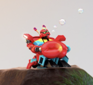

<p align="center">
  
  <p align="center" style="font-size:32px;"><b>Crabsformer</b></p>
  <p align="center">
    <i>
    Crabsformer is an easy-to-use fundamental library for
    scientific computing with Rust, highly inspired by
    <a href="http://www.numpy.org/">NumPy</a>.
    </i>
  </p>
</p>

<p align="center">
  <a href="https://travis-ci.com/pyk/Crabsformer"></a>
  <a href="https://crates.io/crates/crabsformer"></a>
  <a href="https://docs.rs/crabsformer"></a>
  <a href="https://crates.io/crates/crabsformer"></a>
</p>


**Notice!** This project is in early phase. Expect bugs and missing features.


## Documentation
- [Quickstart Tutorial][quickstart tutorial]
- [API Reference]

[NumPy]: http://www.numpy.org/
[API Reference]: https://docs.rs/crabsformer

## Usage
Add this to your `Cargo.toml`:

```toml
[dependencies]
crabsformer = "2019.3.17"
```

and this to your crate root:

```rust
use crabsformer::prelude::*;
```

To get started using Crabsformer, read the [quickstart tutorial].

[quickstart tutorial]:  https://docs.rs/crabsformer#quickstart-tutorial

## Getting help
Feel free to start discussion at [GitHub issues].

[Github issues]: https://github.com/pyk/crabsformer/issues/new/choose

## License
Crabsformer is licensed under the [Apache-2.0](./LICENSE) license.

### Contribution
Unless you explicitly state otherwise, any contribution intentionally
submitted for inclusion in Crabsformer by you, as defined in the Apache-2.0
license, shall be licensed as above, without
any additional terms or conditions.
